# HERCULES 500

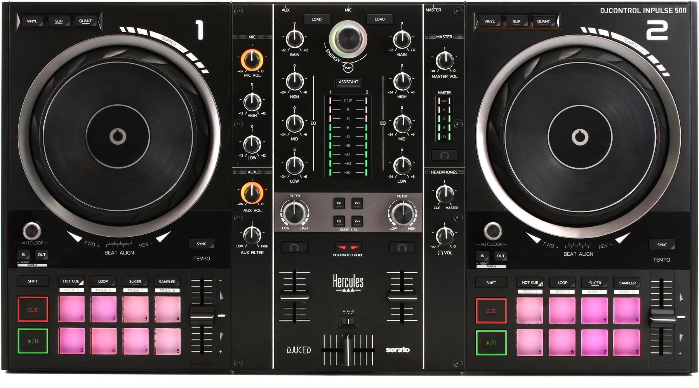

## Que es una onda

En física, la palabra "onda" se utiliza para designar la transmisión (`propagación`) de energía de un lugar a otro.

Otra definicion: Una onda es una `perturbación` que se desplaza en un determinado medio y que tras pasar deja la materia en su estado inicial.

⭐ Al estudiar las ondas es importante recordar que las ondas transfieren energía, NO materia.

> La palabra perturbación se refiere a cualquier cambio o alteración que ocurre en un medio que inicia el movimiento de la onda. Ejemplo, cuando golpeas una cuerda de una guitarra, esa acción de golpear es la perturbación que hace que la cuerda vibre y produzca ondas sonoras.

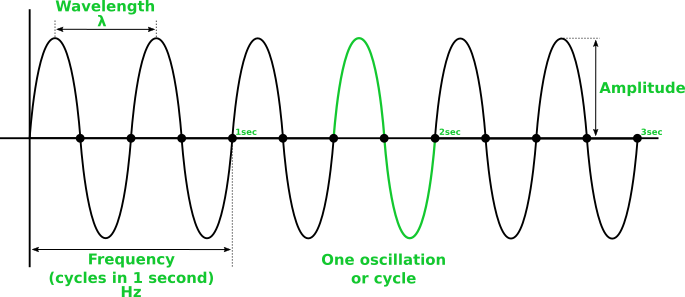

### Propiedades de las ondas:

- Amplitud: Distancia desde el nivel de cresta hasta el nivel de valle. Está directamente relacionada con la cantidad de energía que transporta una onda.
- Período: Tiempo en completar un ciclo.
Su unidad es el segundo.
- Longitud de onda (wavelength): Distancia entre puntos idénticos en ciclos adyacentes de cresta.
Frecuencia: Número de ciclos en 1 segundo. Su unidad es el hercio (Hz), 1Hz=Un ciclo por segundo. La imagen muestra una onda de 2Hz

>  Cuando subes el volumen en tu estéreo usando la perilla de volumen, lo que realmente estás haciendo es incrementar la amplitud de las ondas sonoras, pero la frecuencia permanece igual.

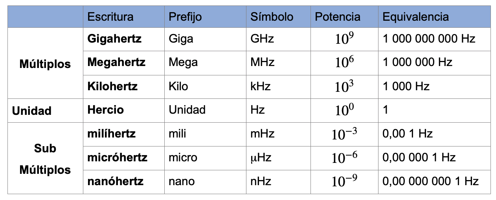

## Medios

La sustancia a través de la cual se propaga una onda se denomina medio. Ejemplos: aire, agua, etc.

> Nota: Hay ondas que pueden propagarce por el vacio, la luz es un ejemplo, los rayos de luz del sol viajan por el espacio hasta llegar a la tierra.

## Clasificacion de las ondas segun el medio

Las ondas se pueden clasificar dependiendo si necesitan un medio o no:

- `Ondas Mecanicas`: Son ondas que necesitan un medio para su propagacion, el sonido es una onda que necesita el aire para su propagacion.
- `Ondas electromagneticas`: Son ondas que no necesitan un medio, pueden propagarce por el vacio. La las ondas de radio y la luz son un ejemplo.

## Clasificacion de las ondas segun su movimiento

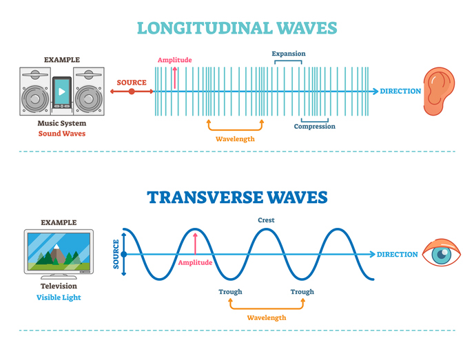

Otra forma de clasificar las ondas es dependiendo la forma en la que se mueven:

- `Ondas longitudinales`: Son ondas en las que la perturbacion se mueve en la misma direccion de la onda, el sonido es un ejemplo.
- `Ondas transversales`: Son ondas que se mueven perpendicularmente a la direccion a la que viajan.

## Excursión

Las bocinas (o altavoces) funcionan mediante un proceso llamado excursión. La excursión se refiere al movimiento de ida y vuelta del diafragma del altavoz (también conocido como cono) que empuja el aire para generar sonido:

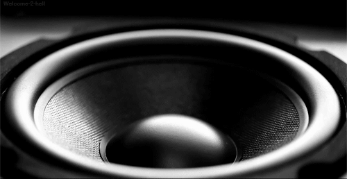

Es por esta razon que el sonido se consideran ondas mecanicas, porque necesitan y empujan aire. Tambien el sonido se puede clasificar como una onda longitudinal porque empujan el aire en la misma direccion en la que la onda viaja.

## Clasificacion de las frecuencias en la musica

- **Frecuencias graves (bajas)**
    - Rango: Aproximadamente de 20 Hz a 250 Hz
    - Ejemplos:
        - El sonido de un bombo (kick drum) en la música electrónica.
        - El bajo eléctrico o el sub-bajo en un sistema de sonido.
        - El rugido profundo de un trueno o las notas bajas de un órgano.

- **Frecuencias medias**
    - Rango: Aproximadamente de 250 Hz a 4 kHz
    - Ejemplos:
        - La voz humana (la mayoría de las voces, especialmente las masculinas, se encuentran en este rango).
        - Instrumentos como la guitarra acústica o el piano tocan notas que caen en este rango.
        - El sonido de una trompeta o un saxofón alto también resalta en las frecuencias medias.

- **Frecuencias agudas (altas)**
    - Rango: Aproximadamente de 4 kHz a 20 kHz
    - Ejemplos:
        - Los platillos de una batería (hi-hats y crash cymbals).
        - Los sonidos de los pájaros o un silbato agudo.
        - El brillo de una flauta o los efectos agudos de sintetizadores.

Estas son las 3 frecuencias en la musica aunque en algunas ocasiones podemos encontrar mas subcategorias:

- Agudos
- Semi agudos (high-mid)
- Medios
- Medios bajos
- Bajos

Pero al final solo son divisiones que estan dentro del rango audible para los humanos (20 Hz hasta 20,000 Hz o 20 kHz)

## Ecualizador

Un ecualizador (equalizer o EQ) ajusta la amplitud de grupos específicos de frecuencias en una señal de audio. Esto te permite resaltar o atenuar ciertas frecuencias según el sonido que quieras lograr.

En un controlador DJ normalmente el EQ tiene tres perillas para ajustar graves, medios y agudos o en controladores pequenos solo graves y agudos:

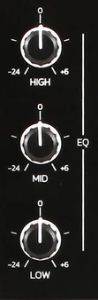

> La imagen de arriba muestra el ecualizador del controlador DJ Hercules 500.

Equipos dedicados a solo ecualizar suelen tener mas subdivisiones, aunque tambien los ecualizadores en software suelen tener esa capacidad:

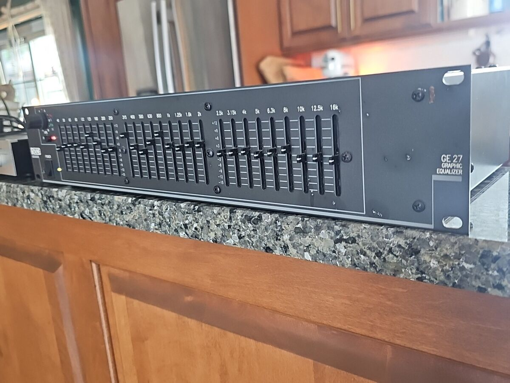

## Mas recursos para aprender:

Videos:

- Ondas: luz, sonido y la naturaleza de la realidad (INGLES): https://www.youtube.com/watch?v=Io-HXZTepH4

## Partes del Mixer en la Hercules 500

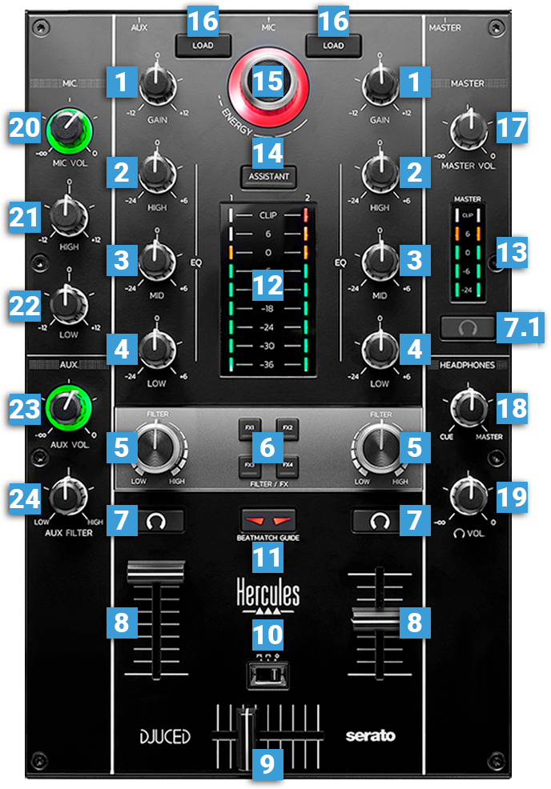

1. Ganancia (Gain en ingles): Utilice esta perilla (knob en ingles) para ajustar el nivel de salida general de cada Deck. Cuando la perilla esta en el centro entonces la pista estara en su nivel original. Tip: Ajusta la ganancia con la ayuda del vúmetro (numero 12), el nivel en el vumetro idealmente debe estar en 0dB.

2. Ecualizacion de agudos/altos (Eq High): esta perilla se usa para cortar/aumentar (cut/boost) las frecuencias de la banda alta (agudos) del ecualizador.
At the middle/center position, the EQ is OFF. Cuando la perilla esta en el centro la qcualizacion de agudos esta desactivada.

3. Ecualizadpr de medios (Eq Mid): similar al #2 pero para medios. Cuando la perilla esta en el centro la qcualizacion de agudos esta desactivada.

4. Ecualizador de graves o bajos (Eq Low): similar al #2 pero para los bajos (tambien se le puede decir bass). Cuando la perilla esta en el centro la qcualizacion de agudos esta desactivada. Tip: Al momento de hacer una transicion puede ser buena eleccion disminuir los bajos hasta quitarlos en lugar de aumentarlos.

5. Filtro (FILTER):	Esta perilla aplica un filtro low-pass cuando se gira a la izquierda o un filtro de high-pass cuando se gira a la derecha cuando FX1, 2, 3 y 4 están desactivados. Es decir, cuando se gira a la izquiera se dejan pasar las frecuencias graves y atenua las agudas, Y cuando se gira a la derecha se pasan las agudas (high-pass) y se atenuan las graves.
    - Si FX1, 2, 3 o 4 está activado, la perilla de filtro aplica un efecto de filtro.
    - Cuando la perilla esta en el centro el filtro esta desactivado.

6. Butones de efectos (Filter Fx Buttons): Aplica los efectos que esten asociados a cada boton, estos efectos se modulan con la perilla del filtro (#5). DJUCED Settings => Mixer to personalize your Filter FX.

7. Botones de pre escucha (Monitoring Buttons)	The buttons with a headphones symbol on them send the pre-fader audio signal of the Left/Right deck to the Headphones channel (also called the CUE audio channel) for pre-listening (connection at the front side).

    7.1 Boton maestro de audifonos (Master headphones button) Envia la senal maestra a los audifonos.

8. Fader de volumen: ajusta el volumen del deck.

    - Cuando el boton de pre-escucha (#7) esta activado y el fader de volumen esta hasta abajo podras seguir escuchando en los audifonos porque el volumen de la pre-escucha lo dicta la perilla de volumen de los audifonos (19)
    > Nota: En cada deck hay un led en forma de numero, ese led se apaga cuando el fader de volumen esta hasta abajo (o cuando no se esta reproduciendo una pista), si se esta reproduciendo una pista y se sube tan solo un poco el volumen entonces el numero se encendera.

9. Crossfader: Cuando esta hasta la izquierda solo el sonido del deck 1 se escuchara en en la salida master (master output), cuando esta hasta la derecha solo el sonido del deck 2 se escichara en la salida master. Estando en el centro el sonido de los dos decks se escuchara en la salida master, en cualquier otra posicion el volumen de cada deck dependera de que tan cerca este del respectivo deck.
    > Nota: La funcion del crossfader es para la salida master, el crossfader no tiene funcion con la preescucha.

10. Curva del Crossfader Curve: se usa para seleccionar la transicion entre decks con el crossfader:
    - Suave/Smooth (for Mixing/para mezclar):es una transicion gradual.
    - Sharp (for Scratching/para escracheo): Cuando el crossfader esta hasta la izquierda solo el deck izquierdo se escuchara, si se mueve tan solo un poco a la derecha entonces el deck de la derecha se escuchara. En esta opccion el volumen no es gradual.
    - Desabilitada/Disabled: no importa si mueves el crossfader, este no tendra efecto y los dos decks se escucharan en la salida master.

    Como preferencia personal me gusta tenerlo en smooth al 100%:
    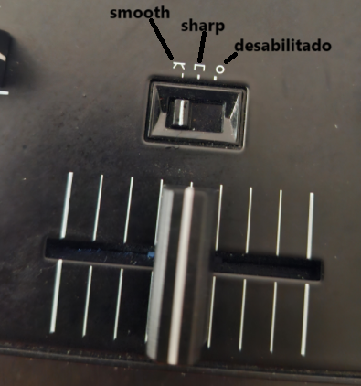
    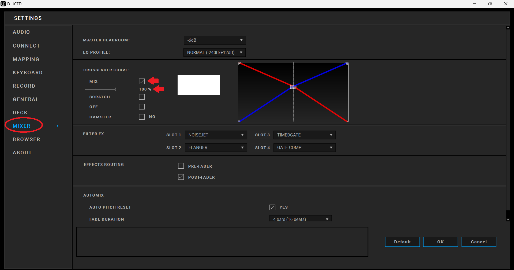

11. Guia de alineacion de beat/Beatmatch Guide: Es un boton para habilitar o deshabilitar la guia led que se encuentra en los decks (se muestra como FWD y REV en los decks).

12. Vumetros (Vu-Meters): Es una guia visual de los niveles de cada deck.
    > Tip: Trata de mantenerte siempre en el verde o incluso naranja pero siempre evita el rojo. 

13. Vumetros maestros (Master Vu-Meters): Indica el nivel de la senal que se enviara a la salida master. Nota: los vumentros son basados en hardware y nor eflejan los vumetros maestros del software.

14. Asistente: Abre o cierra el asistente inteligente de musica en DJUCED.

15. Navegador: Es una perilla y un boton al mismo tiempo, la funcion de perilla sirve para navegar y la de boton para seleccionar.
    
    > Tip: Abre el asistente, presiona el navegador y al mismo tiempo da vuelta, esto cambiara el nivel de sugerencias del asistente, color azul significa menos energia y rojo mas energia.

16. Cargar (Load): presiona load para cargar la cancion en el deck izquierdo o deck 
    > Tip: al presionar y soltar de manera rapida la pista se cargara en el respectivo deck, pero si se presiona mas tiempo se cargara en los dos decks.

17. Volumen maestro (Master Volume): Controla la cantidad de volumen a enviar a la salida master. Tambien es basado en hardware y por eso no se puede cambiar desde DJUCED.

18. Mezclador de los audifonos (Headphones Mix): mezcla la senal del deck (CUE channel) y la salida master en los audifonos.

19. Volumen de los audifonos. Tambien es basado en hardware y por eso no se puede cambiar desde DJUCED.

20. Volumen del microfonoÑ ajusta el nivel de entrada del microfono. Tambien es basado en hardware y por eso no se puede cambiar desde DJUCED.

21. Ecualizador de agudos del microfono.

22. Ecualizador de graves del microfono.

23. Volumen del auxiliar: ajusta en nivel de entrada del auxiliar.
    > Tip: usa el auxiliar para conectar un celular como respaldo.

24. Filtro del auxiliar, aplica un filtro de agudos/graves para la entrada del auxiliar.

## Controles del deck

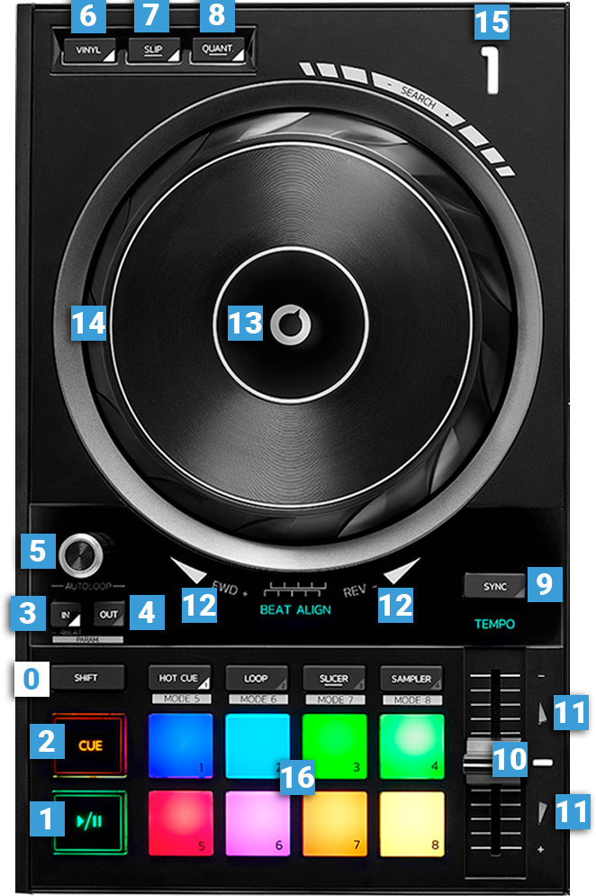

0. SHIFT: Es un boton temporal que permite a una segunda funcionalidad en otro boton.

1. Boton Play/Pausa de la pista cargada.
    - Cuando la pista esta pausada el boton de play parpadea a los BPM (beat por minuto) de la cancion que se esta reproduciendo en el otro deck, esto puede servir para saber cuando empiezas en el ritmo.

2. Boton Cue:
    - Funcion 1: Si la pista esta en pausa establece el CUE pointSet (El triangulo naranja en la senal de la pista).

        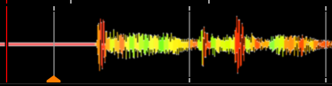

    - Funcion 2: SI la pista esta en pausa y estamos en el CUE point: la pista se reproducira mientras mantengamos el CUE presionado, al momento de soltarlo la pista se pausa y regresa al CUE point.

    - Funcion 3: Si la pista se esta reproduciendo y se presiona el boton CUE entonces la pista se pausa y se regresa al CUE point.

3. Loop In: Se usa para seleecionar la posicion de inicio para empezar a marcar un loop de manera manual.

    - Si dejas presionado LOOP IN entonces crearas un loop de 4 beats.
    - Si haces el paso anterior y despues vuelves a presionar LOOP IN de nuevo podras editar el loop con el Jogwheel. Como hacerlo:
        1. Deja presionado LOOP IN por un tiempo y se crearan 4 beats.
        2. Mueve el Jogwheel para darle espacio.
        3. Presiona y suelta LOOP IN.
        4. Ahora podras recortar el loop usando el jogwheel hasta donde lo moviste en el paso 2.
        5. Termina de editar el loop presionando LOOP IN de nuevo.
        6. Presiona play para reproducir to loop.
     
4. Loop Out: Se usa para establecer la posicion de fin de un loop manual:

    - Usa LOOP IN para marcar el punto de inicio del loop, despues mueve el jogwheel, finalmente presiona LOOP OUT para marcar el fin del loop.
    - Si se presiona una segunda vez podras editar el fin del loop con el jogwheel.

    > LOOP OUT no tiene una funcionalidad similar a la de LOOP IN cuando se deja presionado por un tiempo.

5. Autoloop	Push: Este es un boton y perilla al mismo tiempo:
    - Al presionarlo se activa/desactiva un loop.
    - Cuando active el loop usalo como perilla para hacer mas grande o mas chico el loop.
    - Si tienes un loop en reproduccion puedes usar la perilla para agrandar o acortar el loop en tiempo real, es un efecto commun.
    - Si estas reproduciendo un loop puedes liberarlo y la pista seguira en reproduccion, lo puedes hacer en combinancion del punto anterior.
    - Cuando no este activado puedes darle vuelta a la perilla y ver en DJUCE como cambia la cantidad de beats:

        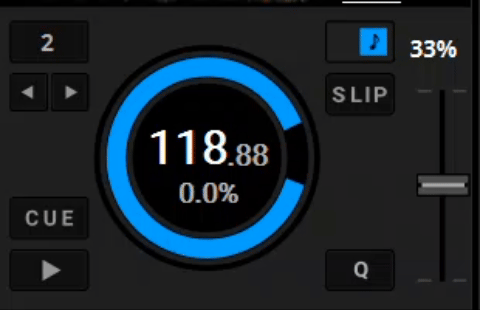

6. Vinyl: este boton activa o desactivo el modo vinyl.

    - Ejercicio:
        - Activa el modo vinyl (desactiva SLIP y QUANT si es que estan activados).
        - Reproduce una pista.
        - Mueve el jogwheel para ver como es el modo vinyl.
        - Despues puedes desactivarlo y mover el jogwheel, veras que el movimento del jogwheel no tiene efecto sobre la pista.
    
    - Mezclar:
        - Cuando Vinyl esta activado el plato del jogwheel (la parte de arriba) la puedes usar para escrachear, puedes usar el otro deck y rotar el plato por el borde (sin tocar el plato), hacer esto por el borde te permite emparejar los beats de las dos pistas manualmente.
    
    > Nota: el plato y el borde del jogwheel parecieran ser una sola cosa, pero en realidad el plato es sensible al tacto, intenta reproducir una pista y con Vinyl activado toca el plato, despues ve que pasa si solo mueves tocando el borde.

7. Activar/Desactivar el modo Slip: El modo permite que las acciones que haces en la pista, como scratches, loops, o cues, se reproduzcan temporalmente mientras la canción sigue avanzando en segundo plano. Cuando desactivas el modo Slip, la canción continúa desde el punto donde estaría si no hubieras realizado ninguna acción, permitiendo que tus efectos sean temporales sin interrumpir el flujo de la música.

    - Ejercicio:
          - Activa Vinyl y Slip
          - Reproduce una cancion
          - Escrachea por un tiempo (veras que la onda se parte en dos en DJUCED)
          - La pista seguira rerproduciendoce en segundo plano (es decir, no se escuchara pero los segundos siguen avanzando)
          - Cuando dejes de escrachear la cancion continuara pero no en el segundo en el que empezaste a escrachear, si no que se tomara la reproduccion que estaba en segundo plano.

8. Activar/Desactivar el modo Quantize: El modo Quantize permite que CUE, LOOP, y HOT CUE se ejecuten en Tempo.

    - Caracteristicas escondidas:
        - Shift + Quantize = Establece el comienzo del Beat Grid en la posición del Play Head.
        - Quantize + Jogwheel = desplaza la posición del Beat Grid hacia atrás/adelante.

9. Activar/Desactivar el modo Sincronizacion: Sincroniza el deck actual con el tempo master. En este caso, no se puede cambiar el tempo. Define el deck como tempo master para la sincronización.

10. Tempo Fader	(tambien llamado Pitch Fader): Ajusta el tempo (velocidad) de la pista cargada. Cuando esta en medio la pista esta en su velocidad original.

11. Guias de Tempo Guides: Son parte del sistema de guía Beatmatch. Estos LED de flechas rojas indican si necesitas disminuir o aumentar el tempo para que coincida con el BPM del otro deck. Cuando el tempo coincide con el otro deck, las flechas rojas se apagan y el texto del LED verde "TEMPO" se ilumina.

12. Guias de alineacion de Beat: Las guías de alineación de ritmos forman parte del sistema de guía Beatmatch. Estos LED con flechas rojas indican si necesitas atrazar o adelantar la pista que estás reproduciendo para que coincida con la cuadrícula de ritmos del otro deck. Sigue las flechas moviendo el anillo exterior del Jogwheel (14). Cuando la coincidencia de ritmo es correcta, las flechas rojas se apagan y los LED verdes 'BEAT ALIGN' se encienden.

13. Plato del Jogwheel Platter: Cuando el modo Vinyl está activado (por defecto lo esta), al tocar el plato superior se detiene la reproducción y se reanuda al soltarlo. Al girar la rueda al tocar el plato se produce un scrach. Cuando el modo Vinyl está desactivado, al girar la rueda se puede realizar el bending

14. Anillo exterior del Jogwheel: Utilice el anillo exterior para ralentizar o acelerar la pista que está reproduciendo.

15. Al aire (on air): Este LED blanco indica que el Deck es audible en el audio Master (es decir, en los altavoces).

16. Pads: es un conjunto de 8 botones que permite diferentes modos y funciones.

## Modos 1 del Pad: Hot CUE

El boton HOT CUE establece los pads (los 8 botones de colores) en modo Hot Cue y hace que los Hot Cues se muestren en DJUCED.

El modo Hot Cue hace que el boton HOT CUE se queden encendido (no parpadea).

Teniando activado el modo HOT CUE podemos usar los botones del pad para asignar "hot cues" en la cancion, es decir puntos clave en la cancion. estos puntos claves se reproduciran cuando dejemos apretado cada boton del pad y se dejaran de reproducir cuando los dejemos de presionar.

Para eliminar un hot cue debemos usar la combinacion SHIFT + el pad que deseemos quitar.

### Modo 5: Toneplay

El mismo boton HOT CUE sirve para activar el modo toneplay (que sirve para jugar con los tonos de la cancion)

Para activar el modo Toneplay hay que presionar SHIFT + Boton HOT CUE, sabremos que el modo Toneplay esta activado cuando el boton HOT CUE este parpadeando.

Una vez que tengamos el modo Toneplay activado podemos usar los pads para jugar con los tonos de la cancion.

## Modos 2 del Pad: LOOP ROLL
## Modos 3 del Pad: SLICER	Set
## Modos 4 del Pad: SAMPLER

MODO 1 – HOT CUE Establezca los pads en modo Hot Cue y muestre los Hot Cues en la interfaz DJUCED. Establezca los pads en MODO 5: Toneplay (el LED blanco parpadea)
MODO 2 – LOOP ROLL Establezca los pads en modo Loop Roll y muestre el Loop Roll en la interfaz DJUCED. Establezca los pads en MODO 6: PadFX (el LED blanco parpadea)
MODO 3 – SLICER Establezca los pads en modo Slicer y muestre el Slicer en la interfaz DJUCED. Establezca los pads en MODO 7: SLICER LOOP (el LED blanco parpadea)
MODO 4 – SAMPLER Establezca los pads en modo Sampler Establezca los pads en MODO 8: BEAT JUMP (el LED blanco parpadea) y muestre el BEAT JUMP en la interfaz DJUCED.

MODE 1 – HOT CUE	Set Pads to Hot Cue mode and displays the Hot Cues on DJUCED interface.	Set Pads to MODE 5: Toneplay (white led is blinking)
MODE 2 – LOOP ROLL	Set Pads to Loop Roll mode and displays the Loop Roll on DJUCED interface.	Set Pads to MODE 6: PadFX (white led is blinking)
MODE 3 – SLICER	Set Pads to Slicer mode and displays the Slicer on DJUCED interface.	Set Pads to MODE 7: SLICER LOOP (white led is blinking)
MODE 4 – SAMPLER	Set Pads to Sampler mode	Set Pads to MODE 8: BEAT JUMP (white led is blinking) and displays the BEAT JUMP on DJUCED interface.

## Acciones para recordar

Abrir efectos desde el controlador:
- Presionar Shift + LOOP y soltar
- El boton LOOP debe quedar parpadenado
- El boton 4 del pad abre y cierra el menu de efectos en DJUCED.

Regresar el head al inicio:
- Presionar shift + CUE

https://www.djuced.com/kb/hercules-djcontrol-inpulse-500/
